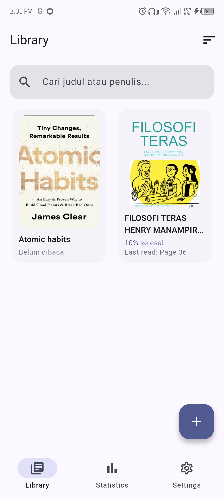
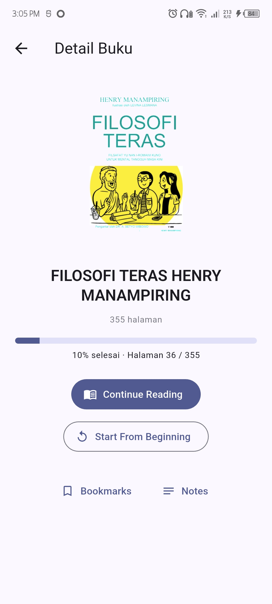
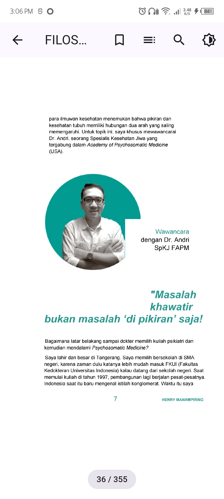
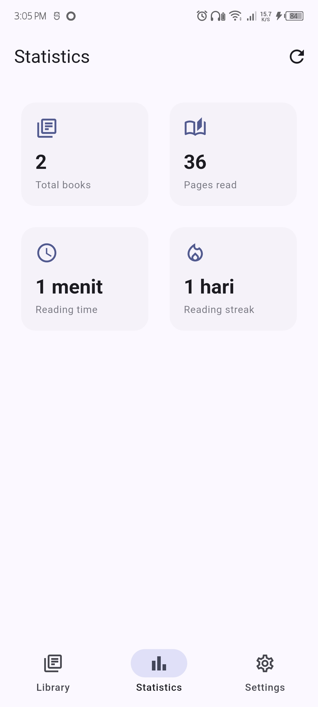
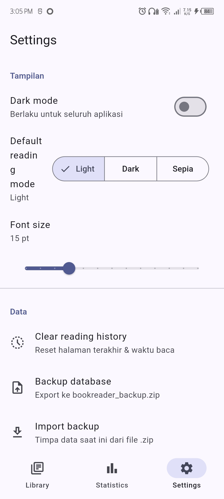

# 📚 Readora

> **Your Personal Offline Reading Companion**

Readora is a modern offline ebook reader built with **Flutter** that helps you organize your personal PDF library, remember your reading progress, and continue exactly where you left off.

Unlike traditional PDF viewers, Readora focuses on delivering a clean, distraction-free reading experience with automatic reading history, progress tracking, and a beautiful modern interface.

---

## ✨ Features

* 📚 Personal offline PDF library
* 📖 Continue reading from your last page automatically
* 🔖 Bookmark important pages
* 📈 Reading statistics
* 📂 Organize your book collection
* 🌙 Beautiful reading experience
* 🎨 Modern Material Design 3 interface
* 📱 Optimized for Android
* 🚀 Fully offline — no account required

---

## 📱 Application Preview

| Splash Screen                                  | Library                                         |
| ---------------------------------------------- | ----------------------------------------------- |
|  |  |

| Book Detail                                    | Reading Page                                   |
| ---------------------------------------------- | ---------------------------------------------- |
|  |  |

| Reading Statistics                                 | Settings                                         |
| -------------------------------------------------- | ------------------------------------------------ |
|  |  |

---

## 🛠 Built With

* Flutter
* Dart
* Riverpod
* SQLite
* File Picker
* PDFX

---

## 📂 Project Structure

```text
lib/
├── core/
│   ├── constants/
│   ├── theme/
│   ├── router/
│   └── utils/
│
├── features/
│   ├── books/
│   ├── library/
│   ├── reader/
│   ├── statistics/
│   └── settings/
│
└── main.dart
```

---

## 🚀 Getting Started

### Clone the repository

```bash
git clone https://github.com/septianyoga/readora.git
```

---

### Go to project

```bash
cd readora
```

---

### Install dependencies

```bash
flutter pub get
```

---

### Run the application

```bash
flutter run
```

---

## 📦 Build Release APK

```bash
flutter build apk --release
```

APK output:

```text
build/app/outputs/flutter-apk/app-release.apk
```

---

## 📦 Build Android App Bundle

```bash
flutter build appbundle --release
```

AAB output:

```text
build/app/outputs/bundle/release/app-release.aab
```

---

## 📋 Requirements

* Flutter 3.x+
* Dart SDK
* Android Studio / Android SDK
* JDK 17

Verify your environment:

```bash
flutter doctor
```

---

## 🎯 Roadmap

* [ ] EPUB support
* [ ] Reading goals
* [ ] Highlight & notes
* [ ] Full-text search
* [ ] Cloud backup
* [ ] Reading streak
* [ ] Collections
* [ ] Reading timer
* [ ] Custom themes
* [ ] Tablet optimization

---

## 🤝 Contributing

Contributions are welcome.

Feel free to open an Issue or submit a Pull Request.

---

## 📄 License

This project is licensed under the MIT License.

---

## 👨‍💻 Author

Developed with ❤️ by **Septian Abiyoga**

If you like this project, consider giving it a ⭐ on GitHub.
